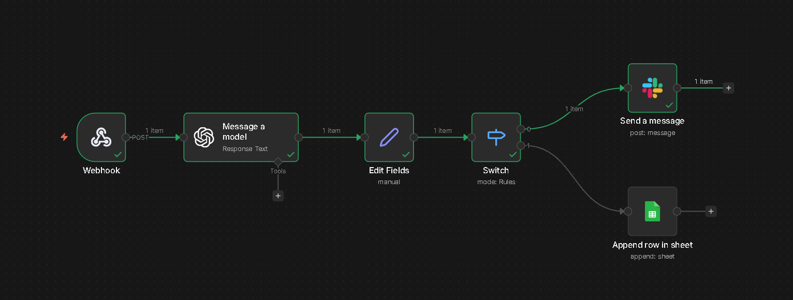

# ServiceDesk AI Agent 

AI-powered Service Desk Automation built using **n8n**, **OpenAI**, **Slack**, and **Google Sheets**.

This project automatically analyzes incoming service requests, classifies them, determines priority, and takes actions like alerting on Slack or logging tickets into Google Sheets.

---

## Workflow Overview

**Flow Explanation:**
1. User submits a service request via Webhook (Postman / API).
2. OpenAI analyzes the issue and returns:
   - Category
   - Priority
   - Action
3. High priority issues are escalated to Slack.
4. Normal issues are logged into Google Sheets.

---

## OpenAI Decision Output

OpenAI classifies the issue logically and responds in structured JSON format.

---

## Slack Alert (High Priority)

If priority is **High**, an alert is sent automatically to Slack with issue details.

---

## Google Sheets Logging (Normal Priority)

If priority is **Low/Medium**, the request is logged into Google Sheets for tracking.

---

## Files Included

- `ServiceDesk.json` → n8n workflow export
- `screenshots/` → workflow & output screenshots
- `README.md` → project documentation

---

## Tech Stack

- n8n (Workflow Automation)
- OpenAI (Decision & Classification)
- Slack (Alerts)
- Google Sheets (Ticket Logging)

---

## Use Case

This system reduces manual service desk effort by automatically:
- Understanding user issues
- Prioritizing tickets
- Escalating critical problems
- Maintaining records
